# Model Dependency Map

## Purpose

This document shows how the recommendation model moves from raw assessment inputs to derived factors, scorecards, plan fit, path fit, outputs, and final recommendation.

`MODEL_ARTIFACT_GLOSSARY` owns artifact meaning and lifecycle notes. `DERIVED_FACTOR_CONTRIBUTIONS` controls executable derived-factor routing. `MODEL_IMPACT_MAP` owns causal relationships and audit/explanation detail. `CALIBRATION` controls actual numeric behavior.

## Score display semantics

The report distinguishes input-profile metrics from path-fit metrics.

Input-profile metrics use factor-specific labels such as Low quality burden
or High delivery strength. Path-fit metrics use Strong fit, Mixed fit, or Low
fit.

Numeric scores remain visible because they help calibration and show movement
within a band, but the qualitative label carries the user-facing interpretation.

## Model Stage Overview

- `rawInput`: assessment answers submitted by the user.
- `inputIndex`: normalized enum indexes or simple intermediate values.
- `derivedFactor`: rule-based factor scores calculated from raw inputs.
- `scorecardRisk`: normalized risks and strengths used by later calculations.
- `planFit`: fit, gap, integration, and support artifacts for Core, Premium, and Enterprise paths.
- `pathScore`: Build/Core/Premium/Enterprise fit scores and selection flags.
- `scenarioLever`: path-specific levers that shape fit strength, burden, and deterministic sensitivity.
- `output`: displayed path-fit metrics and recommendation outputs.
- `recommendation`: final recommendation option, summary, and confidence.

## Calibration Admin Flow

The admin route `/admin/calibration` edits `calibrationOverrides` in the browser.

- overrides live in `localStorage`
- overrides are merged into assessment requests before simulation
- overrides are not stored on the server
- validation runs locally before save or preview
- warnings can be acknowledged so the admin can keep experimenting

## Calibration Tuning

The deterministic calibration is tuned in three layers:

1. Input scales
2. Budgets and shares
3. Policies and thresholds

Budget is the maximum score influence of a local group.

Share is the relative split inside that group.

Policy is a decision boundary or eligibility rule.

Recommended edits:

- change shares to reorder importance within a path
- change budgets to alter total influence
- change thresholds to move decision gates
- validate against the golden scenarios before saving

Avoid these edits:

- comparing shares across unrelated groups
- assuming weights are benchmark-derived
- tuning from one scenario only

## Direction Legend

- `good`: pushes the downstream artifact in a favorable direction.
- `bad`: pushes the downstream artifact in an unfavorable direction.
- `contextual`: the effect depends on the rest of the model.
- `mixed`: has both favorable and unfavorable downstream effects.
- `neutral`: a structural or indexing artifact rather than a directional signal.

## Contained-Scope Guardrail

The model uses a boolean contained-scope guardrail, historically named `simpleScope`, to prevent small or low-risk cases from being over-escalated to paid MUI tiers.

It is not an effort estimate. It affects tier selection and path scoring.

When active, it:

- increases Core credibility,
- makes Premium harder to select,
- lowers packaged-path ICP strength,
- and keeps Build/Core plausible for contained cases.

When inactive, paid tiers can be considered more freely if coverage, support, scale, or complexity justify them.

## Full Dependency Graph

```mermaid
flowchart LR
  subgraph R["Raw inputs"]
    frontendDevelopers["frontendDevelopers"]
    reactApps["reactApps"]
    dependentTeams["dependentTeams"]
    ownershipModel["ownershipModel"]
    existingMuiUsage["existingMuiUsage"]
    designSystemMaturity["designSystemMaturity"]
    primaryUseCase["primaryUseCase"]
    dataHeavyScreens["dataHeavyScreens"]
    expectedRows["expectedRows"]
    expectedColumns["expectedColumns"]
    advancedFeatures["advancedFeatures"]
    accessibilityTarget["accessibilityTarget"]
    changeLeadTime["changeLeadTime"]
    reworkFrequency["reworkFrequency"]
    deadlinePressure["deadlinePressure"]
    supportRequirement["supportRequirement"]
    ownershipHorizon["ownershipHorizon"]
    performanceSensitivity["performanceSensitivity"]
    knowledgeConcentration["knowledgeConcentration"]
    designDevHandoffFriction["designDevHandoffFriction"]
    componentStandardizationGoal["componentStandardizationGoal"]
    productionCriticality["productionCriticality"]
  end

  subgraph I["Input indexes / intermediates"]
    useCaseComplexity["useCaseComplexity"]
    featureWeight["featureWeight"]
    screenLoad["screenLoad"]
    rowScale["rowScale"]
    columnScale["columnScale"]
    accessibilityIndex["accessibilityIndex"]
    changeLeadTimeIndex["changeLeadTimeIndex"]
    reworkFrequencyIndex["reworkFrequencyIndex"]
    dependentTeamsIndex["dependentTeamsIndex"]
    ownershipModelIndex["ownershipModelIndex"]
    muiUsage["muiUsage"]
    maturity["maturity"]
    supportNeed["supportNeed"]
    teamScale["teamScale"]
    appScale["appScale"]
    scaleDemand["scaleDemand"]
    featureDemand["featureDemand"]
  end

  subgraph D["Derived factors"]
    functionalComplexity["functionalComplexity"]
    qualityBurden["qualityBurden"]
    deliveryMaturity["deliveryMaturity"]
    ownershipBurden["ownershipBurden"]
    enterpriseReadiness["enterpriseReadiness"]
  end

  subgraph S["Scorecard risks"]
    functionalRisk["functionalRisk"]
    qualityRisk["qualityRisk"]
    deliveryStrength["deliveryStrength"]
    deliveryRisk["deliveryRisk"]
    ownershipRisk["ownershipRisk"]
    enterpriseNeed["enterpriseNeed"]
  end

  subgraph P["MUI plan fit"]
    useCaseCoverage["useCaseCoverage"]
    featureCoverage["featureCoverage"]
    scaleCoverage["scaleCoverage"]
    supportFit["supportFit"]
    qualityFit["qualityFit"]
    adoptionBoost["adoptionBoost"]
    coverageScore["coverageScore"]
    coverageGap["coverageGap"]
    integrationRisk["integrationRisk"]
    supportGap["supportGap"]
    effectiveMuiPlan["effectiveMuiPlan"]
  end

  subgraph T["Path fit"]
    buildFit["buildFit"]
    coreFit["coreFit"]
    premiumFit["premiumFit"]
    enterpriseFit["enterpriseFit"]
    icpScore["icpScore"]
    simpleScope["simpleScope (contained-scope guardrail)"]
    buildFriendlyContext["buildFriendlyContext"]
  end

  subgraph L["Scenario levers"]
    internalAbsorption["internalAbsorption"]
    buildReuseLeverage["buildReuseLeverage"]
    muiLeverage["muiLeverage"]
    muiAdoptionBurden["muiAdoptionBurden"]
    downsideTailRisk["downsideTailRisk"]
  end

  subgraph O["Outputs"]
    pathFits["pathFits"]
    planFits["planFits"]
    recommendation["recommendation"]
    confidence["confidence"]
  end

  frontendDevelopers --> teamScale
  frontendDevelopers --> enterpriseReadiness
  frontendDevelopers --> supportNeed

  reactApps --> appScale
  reactApps --> ownershipBurden
  reactApps --> enterpriseReadiness

  dependentTeams --> dependentTeamsIndex
  dependentTeams --> ownershipBurden
  dependentTeams --> enterpriseReadiness
  dependentTeams --> downsideTailRisk
  dependentTeams --> internalAbsorption

  ownershipModel --> ownershipModelIndex
  ownershipModel --> ownershipBurden
  ownershipModel --> internalAbsorption
  ownershipModel --> buildReuseLeverage
  ownershipModel --> muiAdoptionBurden

  existingMuiUsage --> muiUsage
  existingMuiUsage --> adoptionBoost
  existingMuiUsage --> coverageScore
  existingMuiUsage --> muiLeverage
  existingMuiUsage --> integrationRisk
  existingMuiUsage --> muiAdoptionBurden
  existingMuiUsage --> buildReuseLeverage

  designSystemMaturity --> maturity
  designSystemMaturity --> ownershipBurden
  designSystemMaturity --> internalAbsorption
  designSystemMaturity --> buildReuseLeverage
  designSystemMaturity --> muiAdoptionBurden

  primaryUseCase --> useCaseComplexity
  primaryUseCase --> useCaseCoverage
  primaryUseCase --> featureDemand
  primaryUseCase --> functionalComplexity
  primaryUseCase --> coverageScore
  primaryUseCase --> effectiveMuiPlan

  dataHeavyScreens --> screenLoad
  dataHeavyScreens --> functionalComplexity
  dataHeavyScreens --> functionalRisk

  expectedRows --> rowScale
  expectedRows --> functionalComplexity
  expectedRows --> qualityBurden
  expectedRows --> scaleCoverage
  expectedRows --> coverageGap
  expectedRows --> integrationRisk
  expectedRows --> downsideTailRisk

  expectedColumns --> columnScale
  expectedColumns --> functionalComplexity
  expectedColumns --> qualityBurden
  expectedColumns --> scaleCoverage
  expectedColumns --> coverageGap
  expectedColumns --> integrationRisk
  expectedColumns --> downsideTailRisk

  advancedFeatures --> featureWeight
  advancedFeatures --> featureDemand
  advancedFeatures --> functionalComplexity
  advancedFeatures --> qualityBurden
  advancedFeatures --> featureCoverage
  advancedFeatures --> coverageGap
  advancedFeatures --> integrationRisk

  accessibilityTarget --> accessibilityIndex
  accessibilityTarget --> qualityBurden
  accessibilityTarget --> qualityRisk

  changeLeadTime --> changeLeadTimeIndex
  changeLeadTime --> deliveryMaturity
  changeLeadTime --> internalAbsorption

  reworkFrequency --> reworkFrequencyIndex
  reworkFrequency --> deliveryMaturity
  reworkFrequency --> downsideTailRisk

  deadlinePressure --> deliveryMaturity
  deadlinePressure --> deliveryRisk
  deadlinePressure --> downsideTailRisk

  supportRequirement --> supportNeed
  supportRequirement --> enterpriseReadiness
  supportRequirement --> supportGap
  supportRequirement --> buildFit
  supportRequirement --> enterpriseFit

  ownershipHorizon --> enterpriseReadiness
  ownershipHorizon --> enterpriseNeed

  performanceSensitivity --> qualityBurden
  performanceSensitivity --> qualityRisk
  performanceSensitivity --> integrationRisk

  knowledgeConcentration --> ownershipBurden
  knowledgeConcentration --> internalAbsorption
  knowledgeConcentration --> downsideTailRisk

  designDevHandoffFriction --> qualityBurden
  designDevHandoffFriction --> buildReuseLeverage
  designDevHandoffFriction --> muiAdoptionBurden
  designDevHandoffFriction --> integrationRisk

  componentStandardizationGoal --> enterpriseReadiness
  componentStandardizationGoal --> buildReuseLeverage
  componentStandardizationGoal --> muiLeverage

  productionCriticality --> qualityBurden
  productionCriticality --> enterpriseReadiness
  productionCriticality --> supportNeed

  useCaseComplexity --> functionalComplexity
  featureWeight --> functionalComplexity
  screenLoad --> functionalComplexity
  rowScale --> functionalComplexity
  columnScale --> functionalComplexity
  accessibilityIndex --> qualityBurden
  changeLeadTimeIndex --> deliveryMaturity
  reworkFrequencyIndex --> deliveryMaturity
  dependentTeamsIndex --> ownershipBurden
  ownershipModelIndex --> ownershipBurden
  muiUsage --> enterpriseReadiness
  maturity --> ownershipBurden
  supportNeed --> enterpriseNeed
  teamScale --> buildFit
  teamScale --> enterpriseFit
  appScale --> buildFit
  appScale --> enterpriseFit
  scaleDemand --> scaleCoverage
  featureDemand --> featureCoverage

  functionalComplexity --> functionalRisk
  qualityBurden --> qualityRisk
  deliveryMaturity --> deliveryStrength
  deliveryStrength --> deliveryRisk
  ownershipBurden --> ownershipRisk
  enterpriseReadiness --> enterpriseNeed

  useCaseCoverage --> coverageScore
  featureCoverage --> coverageScore
  scaleCoverage --> coverageScore
  supportFit --> coverageScore
  qualityFit --> coverageScore
  adoptionBoost --> coverageScore
  coverageScore --> coverageGap
  coverageScore --> integrationRisk
  coverageScore --> supportGap
  coverageScore --> effectiveMuiPlan

  functionalRisk --> buildFit
  qualityRisk --> buildFit
  ownershipRisk --> buildFit
  deliveryRisk --> buildFit
  deliveryStrength --> buildFit
  enterpriseNeed --> buildFit
  simpleScope --> coreFit
  buildFriendlyContext --> buildFit
  enterpriseNeed --> enterpriseFit

  internalAbsorption --> buildReuseLeverage
  buildReuseLeverage --> buildFit
  muiLeverage --> coreFit
  muiLeverage --> premiumFit
  muiLeverage --> enterpriseFit
  muiAdoptionBurden --> coreFit
  muiAdoptionBurden --> premiumFit
  muiAdoptionBurden --> enterpriseFit
  downsideTailRisk --> buildFit

  pathFits --> recommendation
  planFits --> recommendation
  recommendation --> confidence
```

## Mixed-Effect Examples

- `frontendDevelopers` improves `enterpriseReadiness`, can strengthen standardization relevance, and should not increase `ownershipBurden`.
- `existingMuiUsage` improves `adoptionBoost`, `coverageScore`, and `muiLeverage`, lowers `integrationRisk` and `muiAdoptionBurden`, and can reduce `buildReuseLeverage` when the codebase is already standardized.
- `designSystemMaturity` improves `internalAbsorption` and `buildReuseLeverage`, lowers `ownershipBurden`, and can increase `muiAdoptionBurden` when `existingMuiUsage` is none.
- `supportRequirement` raises `supportNeed`, increases `enterpriseReadiness`, can create `supportGap` for weaker MUI paths, and should not force Enterprise by itself.
- `ownershipHorizon` affects enterprise readiness and vendor-backed path relevance, but should not affect effort, fit, schedule, or cost assumptions.
- `dependentTeams` is bad for `ownershipBurden`, `internalAbsorption`, and `downsideTailRisk`, while making `enterpriseReadiness` more contextually relevant.

## Maintenance Rules

- When a numeric value changes, update `CALIBRATION` first.
- When a relationship changes, update `MODEL_IMPACT_MAP`.
- When a stage name changes, update `MODEL_STAGES` and the glossary.
- Keep mixed-effect descriptions explicit so maintainers can see both the benefit and the downside of an input.
- Use the lightweight validator when you need a quick metadata sanity check outside runtime.
