# Model Dependency Map

## 1. Purpose

This document is an internal audit map of how the recommendation model moves from raw assessment inputs to derived factors, path scores, simulation estimates, and final recommendation output.

It is documentation and metadata only. It does not drive calculation behavior.

## 2. Model Stage Overview

| Stage | Purpose |
| --- | --- |
| Raw input | Assessment answers submitted by the user. |
| Input index / intermediate | Normalized enum indexes or simple intermediate values. |
| Derived factor | Rule-based factor scores calculated from raw inputs. |
| Scorecard risk | Normalized model risks and strengths used by later calculations. |
| MUI plan fit | Fit, gap, and support artifacts for Core, Premium, and Enterprise paths. |
| Path score | Rule-based Build/Core/Premium/Enterprise scores and flags. |
| Scenario lever | Path-specific levers that shape effort, risk, and uncertainty. |
| Simulation preparation | Shields, penalties, exposures, and velocity factors used by estimates. |
| Build estimate | Build-path effort, rework, slip, launch, maintenance, and TCO artifacts. |
| MUI estimate | MUI-path effort, rework, slip, launch, maintenance, license, and TCO artifacts. |
| Output | Displayed Build/MUI path estimates and comparison metrics. |
| Recommendation | Final recommendation option, summary, and confidence. |

## 3. Direction Legend

- `good`: pushes the downstream artifact in a favorable direction for that path or outcome.
- `bad`: pushes the downstream artifact in an unfavorable direction.
- `contextual`: the effect depends on the rest of the model and does not have a universally good or bad meaning.
- `cost`: affects monetary exposure or TCO directly.
- `mixed`: has both favorable and unfavorable downstream effects.
- `neutral`: a structural or indexing artifact rather than a directional signal.

## 4. Full Dependency Graph

```mermaid
flowchart LR
  subgraph R["Raw inputs"]
    frontendDevelopers["frontendDevelopers"]
    reactApps["reactApps"]
    dependentTeams["dependentTeams"]
    ownershipModel["ownershipModel"]
    existingMuiUsage["existingMuiUsage"]
    designSystemMaturity["designSystemMaturity"]
    primaryUseCase["primaryUseCase"]
    dataHeavyScreens["dataHeavyScreens"]
    expectedRows["expectedRows"]
    expectedColumns["expectedColumns"]
    advancedFeatures["advancedFeatures"]
    accessibilityTarget["accessibilityTarget"]
    changeLeadTime["changeLeadTime"]
    reworkFrequency["reworkFrequency"]
    deadlinePressure["deadlinePressure"]
    supportRequirement["supportRequirement"]
    maintenanceHorizonMonths["maintenanceHorizonMonths"]
    engineerCostPerDay["engineerCostPerDay"]
    performanceSensitivity["performanceSensitivity"]
    knowledgeConcentration["knowledgeConcentration"]
    designDevHandoffFriction["designDevHandoffFriction"]
    componentStandardizationGoal["componentStandardizationGoal"]
    productionCriticality["productionCriticality"]
  end

  subgraph I["Input indexes / intermediates"]
    useCaseComplexity["useCaseComplexity"]
    featureWeight["featureWeight"]
    screenLoad["screenLoad"]
    rowScale["rowScale"]
    columnScale["columnScale"]
    accessibilityIndex["accessibilityIndex"]
    changeLeadTimeIndex["changeLeadTimeIndex"]
    reworkFrequencyIndex["reworkFrequencyIndex"]
    dependentTeamsIndex["dependentTeamsIndex"]
    ownershipModelIndex["ownershipModelIndex"]
    muiUsage["muiUsage"]
    maturity["maturity"]
    supportNeed["supportNeed"]
    teamScale["teamScale"]
    appScale["appScale"]
    scaleDemand["scaleDemand"]
    featureDemand["featureDemand"]
    horizonYears["horizonYears"]
    laborCostPerWeek["laborCostPerWeek"]
  end

  subgraph D["Derived factors"]
    functionalComplexity["functionalComplexity"]
    qualityBurden["qualityBurden"]
    deliveryMaturity["deliveryMaturity"]
    ownershipBurden["ownershipBurden"]
    enterpriseReadiness["enterpriseReadiness"]
  end

  subgraph S["Scorecard risks"]
    functionalRisk["functionalRisk"]
    qualityRisk["qualityRisk"]
    deliveryStrength["deliveryStrength"]
    deliveryRisk["deliveryRisk"]
    ownershipRisk["ownershipRisk"]
    enterpriseNeed["enterpriseNeed"]
  end

  subgraph P["MUI plan fit"]
    useCaseCoverage["useCaseCoverage"]
    featureCoverage["featureCoverage"]
    scaleCoverage["scaleCoverage"]
    supportFit["supportFit"]
    qualityFit["qualityFit"]
    adoptionBoost["adoptionBoost"]
    coverageScore["coverageScore"]
    coverageGap["coverageGap"]
    integrationRisk["integrationRisk"]
    supportGap["supportGap"]
    effectiveMuiPlan["effectiveMuiPlan"]
  end

  subgraph T["Path scores"]
    buildTierScore["buildTierScore"]
    coreTierScore["coreTierScore"]
    premiumTierScore["premiumTierScore"]
    enterpriseTierScore["enterpriseTierScore"]
    icpScore["icpScore"]
    simpleScope["simpleScope"]
    buildFriendlyContext["buildFriendlyContext"]
    enterpriseFitStrong["enterpriseFitStrong"]
  end

  subgraph L["Scenario levers"]
    internalAbsorption["internalAbsorption"]
    buildReuseLeverage["buildReuseLeverage"]
    muiLeverage["muiLeverage"]
    muiAdoptionBurden["muiAdoptionBurden"]
    downsideTailRisk["downsideTailRisk"]
  end

  subgraph SP["Simulation preparation"]
    coverageStrength["coverageStrength"]
    coverageShield["coverageShield"]
    buildAbsorptionShield["buildAbsorptionShield"]
    buildTailPenalty["buildTailPenalty"]
    muiLeverageShield["muiLeverageShield"]
    muiAdoptionLoad["muiAdoptionLoad"]
    buildFatTailExposure["buildFatTailExposure"]
    muiFatTailExposure["muiFatTailExposure"]
    buildVelocity["buildVelocity"]
    muiVelocity["muiVelocity"]
  end

  subgraph B["Build estimate"]
    buildEngineeringMean["buildEngineeringMean"]
    buildEngineeringVariance["buildEngineeringVariance"]
    buildReworkMean["buildReworkMean"]
    buildRework["buildRework"]
    buildEngineering["buildEngineering"]
    buildSlipMean["buildSlipMean"]
    buildSlip["buildSlip"]
    buildLaunch["buildLaunch"]
    buildMaintenance["buildMaintenance"]
    buildTotalCost["buildTotalCost"]
  end

  subgraph M["MUI estimate"]
    muiEngineeringMean["muiEngineeringMean"]
    muiEngineeringVariance["muiEngineeringVariance"]
    muiReworkMean["muiReworkMean"]
    muiRework["muiRework"]
    muiEngineering["muiEngineering"]
    muiSlipMean["muiSlipMean"]
    muiSlip["muiSlip"]
    muiLaunch["muiLaunch"]
    muiMaintenance["muiMaintenance"]
    estimatedLicensedDevelopers["estimatedLicensedDevelopers"]
    muiLicenseCost["muiLicenseCost"]
    muiTotalCost["muiTotalCost"]
  end

  subgraph O["Outputs"]
    buildPath["buildPath"]
    muiPath["muiPath"]
    comparison["comparison"]
  end

  subgraph R2["Recommendation"]
    recommendation["recommendation"]
    confidence["confidence"]
  end

  frontendDevelopers --> teamScale
  frontendDevelopers --> enterpriseReadiness
  frontendDevelopers --> buildVelocity
  frontendDevelopers --> estimatedLicensedDevelopers

  reactApps --> appScale
  reactApps --> ownershipBurden
  reactApps --> enterpriseReadiness
  reactApps --> buildLaunch
  reactApps --> muiLaunch
  reactApps --> estimatedLicensedDevelopers

  dependentTeams --> dependentTeamsIndex
  dependentTeams --> ownershipBurden
  dependentTeams --> enterpriseReadiness
  dependentTeams --> downsideTailRisk
  dependentTeams --> estimatedLicensedDevelopers
  dependentTeams --> internalAbsorption

  ownershipModel --> ownershipModelIndex
  ownershipModel --> ownershipBurden
  ownershipModel --> internalAbsorption
  ownershipModel --> buildReuseLeverage
  ownershipModel --> muiAdoptionBurden

  existingMuiUsage --> muiUsage
  existingMuiUsage --> adoptionBoost
  existingMuiUsage --> coverageScore
  existingMuiUsage --> muiLeverage
  existingMuiUsage --> integrationRisk
  existingMuiUsage --> muiAdoptionBurden
  existingMuiUsage --> buildReuseLeverage

  designSystemMaturity --> maturity
  designSystemMaturity --> ownershipBurden
  designSystemMaturity --> internalAbsorption
  designSystemMaturity --> buildReuseLeverage
  designSystemMaturity --> muiAdoptionBurden

  primaryUseCase --> useCaseComplexity
  primaryUseCase --> useCaseCoverage
  primaryUseCase --> featureDemand
  primaryUseCase --> functionalComplexity
  primaryUseCase --> coverageScore
  primaryUseCase --> effectiveMuiPlan

  dataHeavyScreens --> screenLoad
  dataHeavyScreens --> functionalComplexity
  dataHeavyScreens --> functionalRisk

  expectedRows --> rowScale
  expectedRows --> functionalComplexity
  expectedRows --> qualityBurden
  expectedRows --> scaleCoverage
  expectedRows --> coverageGap
  expectedRows --> integrationRisk
  expectedRows --> downsideTailRisk

  expectedColumns --> columnScale
  expectedColumns --> functionalComplexity
  expectedColumns --> qualityBurden
  expectedColumns --> scaleCoverage
  expectedColumns --> coverageGap
  expectedColumns --> integrationRisk
  expectedColumns --> downsideTailRisk

  advancedFeatures --> featureWeight
  advancedFeatures --> featureDemand
  advancedFeatures --> functionalComplexity
  advancedFeatures --> qualityBurden
  advancedFeatures --> featureCoverage
  advancedFeatures --> coverageGap
  advancedFeatures --> muiAdoptionBurden
  advancedFeatures --> downsideTailRisk

  accessibilityTarget --> accessibilityIndex
  accessibilityTarget --> qualityBurden
  accessibilityTarget --> qualityRisk
  accessibilityTarget --> qualityFit
  accessibilityTarget --> downsideTailRisk

  changeLeadTime --> changeLeadTimeIndex
  changeLeadTime --> deliveryMaturity
  changeLeadTime --> deliveryStrength
  changeLeadTime --> deliveryRisk
  changeLeadTime --> internalAbsorption
  changeLeadTime --> buildVelocity
  changeLeadTime --> muiVelocity

  reworkFrequency --> reworkFrequencyIndex
  reworkFrequency --> deliveryMaturity
  reworkFrequency --> deliveryRisk
  reworkFrequency --> internalAbsorption
  reworkFrequency --> buildReworkMean
  reworkFrequency --> muiReworkMean

  deadlinePressure --> deliveryMaturity
  deadlinePressure --> deliveryRisk
  deadlinePressure --> internalAbsorption
  deadlinePressure --> downsideTailRisk
  deadlinePressure --> buildSlip

  supportRequirement --> supportNeed
  supportRequirement --> enterpriseReadiness
  supportRequirement --> supportGap
  supportRequirement --> buildTierScore

  maintenanceHorizonMonths --> horizonYears
  maintenanceHorizonMonths --> buildMaintenance
  maintenanceHorizonMonths --> muiMaintenance
  maintenanceHorizonMonths --> muiLicenseCost
  maintenanceHorizonMonths --> enterpriseReadiness

  engineerCostPerDay --> laborCostPerWeek
  engineerCostPerDay --> buildTotalCost
  engineerCostPerDay --> muiTotalCost

  performanceSensitivity --> qualityBurden
  performanceSensitivity --> functionalComplexity
  performanceSensitivity --> downsideTailRisk
  performanceSensitivity --> muiAdoptionBurden

  knowledgeConcentration --> ownershipBurden
  knowledgeConcentration --> internalAbsorption
  knowledgeConcentration --> downsideTailRisk
  knowledgeConcentration --> buildMaintenance

  designDevHandoffFriction --> qualityBurden
  designDevHandoffFriction --> buildReuseLeverage
  designDevHandoffFriction --> muiAdoptionBurden
  designDevHandoffFriction --> downsideTailRisk

  componentStandardizationGoal --> enterpriseReadiness
  componentStandardizationGoal --> muiLeverage
  componentStandardizationGoal --> buildReuseLeverage

  productionCriticality --> qualityBurden
  productionCriticality --> enterpriseReadiness
  productionCriticality --> supportGap
  productionCriticality --> downsideTailRisk

  useCaseComplexity --> functionalComplexity
  featureWeight --> functionalComplexity
  screenLoad --> functionalComplexity
  rowScale --> functionalComplexity
  columnScale --> functionalComplexity
  accessibilityIndex --> qualityBurden
  changeLeadTimeIndex --> deliveryMaturity
  reworkFrequencyIndex --> deliveryMaturity
  dependentTeamsIndex --> ownershipBurden
  ownershipModelIndex --> ownershipBurden
  muiUsage --> enterpriseReadiness
  maturity --> ownershipBurden
  supportNeed --> supportGap
  teamScale --> icpScore
  appScale --> icpScore
  scaleDemand --> buildFatTailExposure
  featureDemand --> coverageGap
  horizonYears --> buildMaintenance
  laborCostPerWeek --> buildTotalCost

  functionalComplexity --> functionalRisk
  qualityBurden --> qualityRisk
  deliveryMaturity --> deliveryStrength
  deliveryMaturity --> deliveryRisk
  ownershipBurden --> ownershipRisk
  enterpriseReadiness --> enterpriseNeed

  primaryUseCase --> useCaseCoverage
  advancedFeatures --> featureCoverage
  rowScale --> scaleCoverage
  columnScale --> scaleCoverage
  supportNeed --> supportFit
  qualityBurden --> qualityFit
  existingMuiUsage --> adoptionBoost

  useCaseCoverage --> coverageScore
  featureCoverage --> coverageScore
  scaleCoverage --> coverageScore
  supportFit --> coverageScore
  qualityFit --> coverageScore
  adoptionBoost --> coverageScore
  coverageScore --> coverageGap
  coverageScore --> integrationRisk
  enterpriseNeed --> supportGap
  enterpriseNeed --> enterpriseFitStrong

  functionalRisk --> buildTierScore
  qualityRisk --> buildTierScore
  ownershipRisk --> buildTierScore
  deliveryRisk --> buildTierScore
  functionalRisk --> coreTierScore
  qualityRisk --> coreTierScore
  enterpriseNeed --> coreTierScore
  coverageScore --> coreTierScore
  coverageScore --> premiumTierScore
  coverageScore --> enterpriseTierScore
  supportNeed --> premiumTierScore
  supportNeed --> enterpriseTierScore
  simpleScope --> buildFriendlyContext
  enterpriseNeed --> enterpriseFitStrong

  deliveryStrength --> internalAbsorption
  maturity --> internalAbsorption
  ownershipRisk --> internalAbsorption
  internalAbsorption --> buildAbsorptionShield
  buildReuseLeverage --> buildAbsorptionShield
  buildReuseLeverage --> buildVelocity
  muiLeverage --> muiLeverageShield
  muiAdoptionBurden --> muiAdoptionLoad
  downsideTailRisk --> buildTailPenalty
  downsideTailRisk --> buildFatTailExposure
  muiAdoptionBurden --> muiFatTailExposure
  muiLeverage --> muiFatTailExposure
  coverageStrength --> coverageShield
  coverageScore --> coverageStrength
  coverageGap --> muiLeverage
  supportGap --> muiLeverage
  coverageGap --> muiAdoptionBurden
  integrationRisk --> muiAdoptionBurden
  buildVelocity --> buildLaunch
  muiVelocity --> muiLaunch

  buildAbsorptionShield --> buildEngineeringMean
  buildTailPenalty --> buildEngineeringMean
  buildFatTailExposure --> buildEngineeringMean
  buildAbsorptionShield --> buildReworkMean
  buildTailPenalty --> buildReworkMean
  buildAbsorptionShield --> buildSlipMean
  buildTailPenalty --> buildSlipMean
  buildVelocity --> buildLaunch
  buildEngineeringMean --> buildEngineering
  buildEngineeringVariance --> buildEngineering
  buildReworkMean --> buildRework
  buildRework --> buildEngineering
  buildEngineering --> buildLaunch
  buildSlipMean --> buildSlip
  buildSlip --> buildLaunch
  buildLaunch --> buildPath
  buildMaintenance --> buildPath
  buildTotalCost --> buildPath

  coverageStrength --> muiEngineeringMean
  coverageShield --> muiEngineeringMean
  muiAdoptionLoad --> muiEngineeringVariance
  muiLeverage --> muiEngineeringMean
  muiAdoptionBurden --> muiEngineeringMean
  muiEngineeringMean --> muiEngineering
  muiEngineeringVariance --> muiEngineering
  muiReworkMean --> muiRework
  muiRework --> muiEngineering
  muiEngineering --> muiLaunch
  muiSlipMean --> muiSlip
  muiSlip --> muiLaunch
  muiLaunch --> muiPath
  muiMaintenance --> muiPath
  muiLicenseCost --> muiPath
  estimatedLicensedDevelopers --> muiLicenseCost
  muiTotalCost --> muiPath

  buildPath --> comparison
  muiPath --> comparison
  comparison --> recommendation
  comparison --> confidence

  dependentTeams -. "bad for Build" .-> ownershipBurden
  dependentTeams -. "contextual/vendor relevance" .-> enterpriseReadiness
  dependentTeams -. "bad" .-> downsideTailRisk
  dependentTeams -. "Enterprise cost exposure" .-> estimatedLicensedDevelopers
```

## 5. Mixed-Effect Examples

- `dependentTeams` increases `ownershipBurden`, which hurts Build, but it also increases `enterpriseReadiness`, which makes vendor-backed paths more relevant.
- `existingMuiUsage` improves `adoptionBoost` and `muiLeverage`, but it can reduce `buildReuseLeverage` because standardized MUI leaves less room for internal reuse on the Build path.
- `designSystemMaturity` helps `internalAbsorption` and `buildReuseLeverage`, but when `existingMuiUsage` is `none` it can still add `muiAdoptionBurden` because internal patterns need adaptation.
- `performanceSensitivity` can help MUI only when the selected plan is already performance-ready; otherwise it adds burden to both paths.
- `componentStandardizationGoal` increases `enterpriseReadiness`, but it does not automatically favor MUI or Build on its own.

## 6. Known Limitation

The map is maintained manually and is intentionally descriptive rather than executable. If formulas change without a metadata update, this document can become stale.

## 7. Maintenance Rules

- When a formula changes, update `MODEL_IMPACT_MAP`.
- When an artifact is added, update `MODEL_ARTIFACT_GLOSSARY`.
- When a new model stage is added, update `MODEL_STAGES`.
- This map is documentation and audit metadata and does not drive calculation yet.
