# Model Dependency Map

## Purpose

This document shows how the recommendation model moves from raw assessment inputs to derived factors, scorecards, plan fit, simulation prep, estimates, outputs, and final recommendation.

`MODEL_ARTIFACT_GLOSSARY` owns artifact meaning and lifecycle notes. `MODEL_IMPACT_MAP` owns causal relationships. `CALIBRATION` controls actual numeric behavior.

## Model Stage Overview

- `rawInput`: assessment answers submitted by the user.
- `inputIndex`: normalized enum indexes or simple intermediate values.
- `derivedFactor`: rule-based factor scores calculated from raw inputs.
- `scorecardRisk`: normalized risks and strengths used by later calculations.
- `planFit`: fit, gap, integration, and support artifacts for Core, Premium, and Enterprise paths.
- `pathScore`: rule-based Build/Core/Premium/Enterprise scores and selection flags.
- `scenarioLever`: path-specific levers that shape effort, risk, uncertainty, and path credibility.
- `simulationPrep`: shields, penalties, exposures, and velocity factors used by estimates.
- `buildEstimate`: Build-path effort, rework, slip, launch, maintenance, and TCO artifacts.
- `muiEstimate`: MUI-path effort, rework, slip, launch, maintenance, license, and TCO artifacts.
- `output`: displayed Build/MUI estimates and comparison metrics.
- `recommendation`: final recommendation option, summary, and confidence.

## Direction Legend

- `good`: pushes the downstream artifact in a favorable direction.
- `bad`: pushes the downstream artifact in an unfavorable direction.
- `contextual`: the effect depends on the rest of the model.
- `cost`: affects monetary exposure or TCO directly.
- `mixed`: has both favorable and unfavorable downstream effects.
- `neutral`: a structural or indexing artifact rather than a directional signal.

## Full Dependency Graph

```mermaid
flowchart LR
  subgraph R["Raw inputs"]
    frontendDevelopers["frontendDevelopers"]
    reactApps["reactApps"]
    dependentTeams["dependentTeams"]
    ownershipModel["ownershipModel"]
    existingMuiUsage["existingMuiUsage"]
    designSystemMaturity["designSystemMaturity"]
    primaryUseCase["primaryUseCase"]
    dataHeavyScreens["dataHeavyScreens"]
    expectedRows["expectedRows"]
    expectedColumns["expectedColumns"]
    advancedFeatures["advancedFeatures"]
    accessibilityTarget["accessibilityTarget"]
    changeLeadTime["changeLeadTime"]
    reworkFrequency["reworkFrequency"]
    deadlinePressure["deadlinePressure"]
    supportRequirement["supportRequirement"]
    maintenanceHorizonMonths["maintenanceHorizonMonths"]
    engineerCostPerDay["engineerCostPerDay"]
    performanceSensitivity["performanceSensitivity"]
    knowledgeConcentration["knowledgeConcentration"]
    designDevHandoffFriction["designDevHandoffFriction"]
    componentStandardizationGoal["componentStandardizationGoal"]
    productionCriticality["productionCriticality"]
  end

  subgraph I["Input indexes / intermediates"]
    useCaseComplexity["useCaseComplexity"]
    featureWeight["featureWeight"]
    screenLoad["screenLoad"]
    rowScale["rowScale"]
    columnScale["columnScale"]
    accessibilityIndex["accessibilityIndex"]
    changeLeadTimeIndex["changeLeadTimeIndex"]
    reworkFrequencyIndex["reworkFrequencyIndex"]
    dependentTeamsIndex["dependentTeamsIndex"]
    ownershipModelIndex["ownershipModelIndex"]
    muiUsage["muiUsage"]
    maturity["maturity"]
    supportNeed["supportNeed"]
    teamScale["teamScale"]
    appScale["appScale"]
    scaleDemand["scaleDemand"]
    featureDemand["featureDemand"]
    horizonYears["horizonYears"]
    laborCostPerWeek["laborCostPerWeek"]
  end

  subgraph D["Derived factors"]
    functionalComplexity["functionalComplexity"]
    qualityBurden["qualityBurden"]
    deliveryMaturity["deliveryMaturity"]
    ownershipBurden["ownershipBurden"]
    enterpriseReadiness["enterpriseReadiness"]
  end

  subgraph S["Scorecard risks"]
    functionalRisk["functionalRisk"]
    qualityRisk["qualityRisk"]
    deliveryStrength["deliveryStrength"]
    deliveryRisk["deliveryRisk"]
    ownershipRisk["ownershipRisk"]
    enterpriseNeed["enterpriseNeed"]
  end

  subgraph P["MUI plan fit"]
    useCaseCoverage["useCaseCoverage"]
    featureCoverage["featureCoverage"]
    scaleCoverage["scaleCoverage"]
    supportFit["supportFit"]
    qualityFit["qualityFit"]
    adoptionBoost["adoptionBoost"]
    coverageScore["coverageScore"]
    coverageGap["coverageGap"]
    integrationRisk["integrationRisk"]
    supportGap["supportGap"]
    effectiveMuiPlan["effectiveMuiPlan"]
  end

  subgraph T["Path scores"]
    buildTierScore["buildTierScore"]
    coreTierScore["coreTierScore"]
    premiumTierScore["premiumTierScore"]
    enterpriseTierScore["enterpriseTierScore"]
    icpScore["icpScore"]
    simpleScope["simpleScope"]
    buildFriendlyContext["buildFriendlyContext"]
    enterpriseFitStrong["enterpriseFitStrong"]
  end

  subgraph L["Scenario levers"]
    internalAbsorption["internalAbsorption"]
    buildReuseLeverage["buildReuseLeverage"]
    muiLeverage["muiLeverage"]
    muiAdoptionBurden["muiAdoptionBurden"]
    downsideTailRisk["downsideTailRisk"]
  end

  subgraph SP["Simulation preparation"]
    coverageStrength["coverageStrength"]
    coverageShield["coverageShield"]
    buildAbsorptionShield["buildAbsorptionShield"]
    buildTailPenalty["buildTailPenalty"]
    muiLeverageShield["muiLeverageShield"]
    muiAdoptionLoad["muiAdoptionLoad"]
    buildFatTailExposure["buildFatTailExposure"]
    muiFatTailExposure["muiFatTailExposure"]
    buildVelocity["buildVelocity"]
    muiVelocity["muiVelocity"]
  end

  subgraph B["Build estimate"]
    buildEngineeringMean["buildEngineeringMean"]
    buildEngineeringVariance["buildEngineeringVariance"]
    buildReworkMean["buildReworkMean"]
    buildRework["buildRework"]
    buildEngineering["buildEngineering"]
    buildSlipMean["buildSlipMean"]
    buildSlip["buildSlip"]
    buildLaunch["buildLaunch"]
    buildMaintenance["buildMaintenance"]
    buildTotalCost["buildTotalCost"]
  end

  subgraph M["MUI estimate"]
    muiEngineeringMean["muiEngineeringMean"]
    muiEngineeringVariance["muiEngineeringVariance"]
    muiReworkMean["muiReworkMean"]
    muiRework["muiRework"]
    muiEngineering["muiEngineering"]
    muiSlipMean["muiSlipMean"]
    muiSlip["muiSlip"]
    muiLaunch["muiLaunch"]
    muiMaintenance["muiMaintenance"]
    estimatedLicensedDevelopers["estimatedLicensedDevelopers"]
    muiLicenseCost["muiLicenseCost"]
    muiTotalCost["muiTotalCost"]
  end

  subgraph O["Outputs"]
    buildPath["buildPath"]
    muiPath["muiPath"]
    comparison["comparison"]
  end

  subgraph R2["Recommendation"]
    recommendation["recommendation"]
    confidence["confidence"]
  end

  frontendDevelopers --> teamScale
  frontendDevelopers --> enterpriseReadiness
  frontendDevelopers --> buildVelocity
  frontendDevelopers --> muiVelocity
  frontendDevelopers --> estimatedLicensedDevelopers

  reactApps --> appScale
  reactApps --> ownershipBurden
  reactApps --> enterpriseReadiness
  reactApps --> buildLaunch
  reactApps --> muiLaunch
  reactApps --> estimatedLicensedDevelopers

  dependentTeams --> dependentTeamsIndex
  dependentTeams --> ownershipBurden
  dependentTeams --> enterpriseReadiness
  dependentTeams --> downsideTailRisk
  dependentTeams --> estimatedLicensedDevelopers
  dependentTeams --> internalAbsorption

  ownershipModel --> ownershipModelIndex
  ownershipModel --> ownershipBurden
  ownershipModel --> internalAbsorption
  ownershipModel --> buildReuseLeverage
  ownershipModel --> muiAdoptionBurden

  existingMuiUsage --> muiUsage
  existingMuiUsage --> adoptionBoost
  existingMuiUsage --> coverageScore
  existingMuiUsage --> muiLeverage
  existingMuiUsage --> integrationRisk
  existingMuiUsage --> muiAdoptionBurden
  existingMuiUsage --> buildReuseLeverage

  designSystemMaturity --> maturity
  designSystemMaturity --> ownershipBurden
  designSystemMaturity --> internalAbsorption
  designSystemMaturity --> buildReuseLeverage
  designSystemMaturity --> muiAdoptionBurden

  primaryUseCase --> useCaseComplexity
  primaryUseCase --> useCaseCoverage
  primaryUseCase --> featureDemand
  primaryUseCase --> functionalComplexity
  primaryUseCase --> coverageScore
  primaryUseCase --> effectiveMuiPlan

  dataHeavyScreens --> screenLoad
  dataHeavyScreens --> functionalComplexity
  dataHeavyScreens --> functionalRisk

  expectedRows --> rowScale
  expectedRows --> functionalComplexity
  expectedRows --> qualityBurden
  expectedRows --> scaleCoverage
  expectedRows --> coverageGap
  expectedRows --> integrationRisk
  expectedRows --> downsideTailRisk

  expectedColumns --> columnScale
  expectedColumns --> functionalComplexity
  expectedColumns --> qualityBurden
  expectedColumns --> scaleCoverage
  expectedColumns --> coverageGap
  expectedColumns --> integrationRisk
  expectedColumns --> downsideTailRisk

  advancedFeatures --> featureWeight
  advancedFeatures --> featureDemand
  advancedFeatures --> functionalComplexity
  advancedFeatures --> qualityBurden
  advancedFeatures --> featureCoverage
  advancedFeatures --> coverageGap
  advancedFeatures --> integrationRisk

  accessibilityTarget --> accessibilityIndex
  accessibilityTarget --> qualityBurden
  accessibilityTarget --> qualityRisk

  changeLeadTime --> changeLeadTimeIndex
  changeLeadTime --> deliveryMaturity
  changeLeadTime --> internalAbsorption
  changeLeadTime --> buildVelocity

  reworkFrequency --> reworkFrequencyIndex
  reworkFrequency --> deliveryMaturity
  reworkFrequency --> downsideTailRisk
  reworkFrequency --> buildSlip

  deadlinePressure --> deliveryMaturity
  deadlinePressure --> deliveryRisk
  deadlinePressure --> buildSlipMean
  deadlinePressure --> muiSlipMean
  deadlinePressure --> downsideTailRisk

  supportRequirement --> supportNeed
  supportRequirement --> enterpriseReadiness
  supportRequirement --> supportGap
  supportRequirement --> buildTierScore
  supportRequirement --> enterpriseTierScore

  maintenanceHorizonMonths --> horizonYears
  maintenanceHorizonMonths --> buildMaintenance
  maintenanceHorizonMonths --> muiMaintenance
  maintenanceHorizonMonths --> muiTotalCost

  engineerCostPerDay --> laborCostPerWeek
  engineerCostPerDay --> buildTotalCost
  engineerCostPerDay --> muiTotalCost

  performanceSensitivity --> qualityBurden
  performanceSensitivity --> qualityRisk
  performanceSensitivity --> integrationRisk

  knowledgeConcentration --> ownershipBurden
  knowledgeConcentration --> internalAbsorption
  knowledgeConcentration --> downsideTailRisk

  designDevHandoffFriction --> qualityBurden
  designDevHandoffFriction --> buildReuseLeverage
  designDevHandoffFriction --> muiAdoptionBurden
  designDevHandoffFriction --> integrationRisk

  componentStandardizationGoal --> enterpriseReadiness
  componentStandardizationGoal --> buildReuseLeverage
  componentStandardizationGoal --> muiLeverage

  productionCriticality --> qualityBurden
  productionCriticality --> enterpriseReadiness
  productionCriticality --> supportNeed

  useCaseComplexity --> functionalComplexity
  featureWeight --> functionalComplexity
  screenLoad --> functionalComplexity
  rowScale --> functionalComplexity
  columnScale --> functionalComplexity
  accessibilityIndex --> qualityBurden
  changeLeadTimeIndex --> deliveryMaturity
  reworkFrequencyIndex --> deliveryMaturity
  dependentTeamsIndex --> ownershipBurden
  ownershipModelIndex --> ownershipBurden
  muiUsage --> enterpriseReadiness
  maturity --> ownershipBurden
  supportNeed --> enterpriseNeed
  teamScale --> buildTierScore
  teamScale --> enterpriseTierScore
  appScale --> buildTierScore
  appScale --> enterpriseTierScore
  scaleDemand --> scaleCoverage
  featureDemand --> featureCoverage
  horizonYears --> buildMaintenance
  horizonYears --> muiMaintenance
  laborCostPerWeek --> buildTotalCost
  laborCostPerWeek --> muiTotalCost

  functionalComplexity --> functionalRisk
  qualityBurden --> qualityRisk
  deliveryMaturity --> deliveryStrength
  deliveryStrength --> deliveryRisk
  ownershipBurden --> ownershipRisk
  enterpriseReadiness --> enterpriseNeed

  useCaseCoverage --> coverageScore
  featureCoverage --> coverageScore
  scaleCoverage --> coverageScore
  supportFit --> coverageScore
  qualityFit --> coverageScore
  adoptionBoost --> coverageScore
  coverageScore --> coverageGap
  coverageScore --> integrationRisk
  coverageScore --> supportGap
  coverageScore --> effectiveMuiPlan

  functionalRisk --> buildTierScore
  qualityRisk --> buildTierScore
  ownershipRisk --> buildTierScore
  deliveryRisk --> buildTierScore
  deliveryStrength --> buildTierScore
  enterpriseNeed --> buildTierScore
  simpleScope --> coreTierScore
  buildFriendlyContext --> buildTierScore
  enterpriseFitStrong --> enterpriseTierScore

  internalAbsorption --> buildAbsorptionShield
  buildReuseLeverage --> buildAbsorptionShield
  buildAbsorptionShield --> buildEngineeringMean
  buildTailPenalty --> buildEngineeringVariance
  downsideTailRisk --> buildTailPenalty
  muiLeverage --> muiLeverageShield
  muiLeverageShield --> muiEngineeringMean
  muiAdoptionBurden --> muiAdoptionLoad
  muiAdoptionLoad --> muiEngineeringMean
  buildFatTailExposure --> buildEngineeringVariance
  muiFatTailExposure --> muiEngineeringVariance
  buildVelocity --> buildEngineering
  muiVelocity --> muiEngineering

  coverageStrength --> coverageShield
  coverageShield --> buildEngineeringMean

  buildEngineeringMean --> buildEngineeringVariance
  buildEngineeringVariance --> buildReworkMean
  buildReworkMean --> buildRework
  buildRework --> buildEngineering
  buildEngineering --> buildSlipMean
  buildSlipMean --> buildSlip
  buildSlip --> buildLaunch
  buildLaunch --> buildMaintenance
  buildMaintenance --> buildTotalCost

  muiEngineeringMean --> muiEngineeringVariance
  muiEngineeringVariance --> muiReworkMean
  muiReworkMean --> muiRework
  muiRework --> muiEngineering
  muiEngineering --> muiSlipMean
  muiSlipMean --> muiSlip
  muiSlip --> muiLaunch
  muiLaunch --> muiMaintenance
  muiMaintenance --> muiLicenseCost
  estimatedLicensedDevelopers --> muiLicenseCost
  muiLicenseCost --> muiTotalCost

  buildTotalCost --> comparison
  muiTotalCost --> comparison
  buildLaunch --> comparison
  muiLaunch --> comparison
  comparison --> recommendation
  recommendation --> confidence

  dependentTeams --> ownershipBurden
  dependentTeams --> enterpriseReadiness
  dependentTeams --> downsideTailRisk
  dependentTeams --> estimatedLicensedDevelopers
  ownershipBurden --> buildTierScore
```

## Mixed-Effect Examples

- `frontendDevelopers` helps `buildVelocity` and `muiVelocity`, can increase `estimatedLicensedDevelopers`, and should not increase `ownershipBurden`.
- `existingMuiUsage` improves `adoptionBoost`, `coverageScore`, and `muiLeverage`, lowers `integrationRisk` and `muiAdoptionBurden`, and can reduce `buildReuseLeverage` when the codebase is already standardized.
- `designSystemMaturity` improves `internalAbsorption` and `buildReuseLeverage`, lowers `ownershipBurden`, and can increase `muiAdoptionBurden` when `existingMuiUsage` is none.
- `supportRequirement` raises `supportNeed`, increases `enterpriseReadiness`, can create `supportGap` for weaker MUI paths, and should not force Enterprise by itself.
- `engineerCostPerDay` affects only TCO-related cost artifacts and should not affect effort, fit, velocity, or schedule.
- `dependentTeams` is bad for `ownershipBurden`, `internalAbsorption`, and `downsideTailRisk`, while making `enterpriseReadiness` more contextually relevant and increasing Enterprise seat exposure.

## Maintenance Rules

- When a numeric value changes, update `CALIBRATION` first.
- When a relationship changes, update `MODEL_IMPACT_MAP`.
- When a stage name changes, update `MODEL_STAGES` and the glossary.
- Do not treat documentation as a substitute for calibration changes.
- Keep mixed-effect descriptions explicit so maintainers can see both the benefit and the downside of an input.
- Use the lightweight validator when you need a quick metadata sanity check outside runtime.
